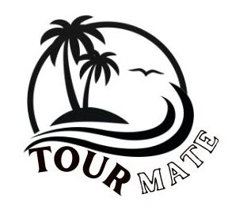

[comment]: # "This is the standard layout for the project, but you can clean this and use your own template"

# TourMate

---

## Team
-  E/20/248, Mapagedara T.L.B, [email](mailto:e20248@eng.pdn.ac.lk)
-  E/20/453, Yogesh R.J, [email](mailto:e20453@eng.pdn.ac.lk)
-  E/20/158, Jananga T.G.C, [email](mailto:e20158@eng.pdn.ac.lk)
-  E/20/300, Prasadinie H.A.M.T, [email](mailto:e20300@eng.pdn.ac.lk)

## Supervisor
-  Dr. Suneth Namal Karunarathna, [email](mailto:namal@eng.pdn.ac.lk)

## Table of Contents
1. [Introduction](#introduction)
2. [Links](#links)

---

This is a sample image, to show how to add images to your page. To learn more options, please refer [this](https://projects.ce.pdn.ac.lk/docs/faq/how-to-add-an-image/)

## Introduction

Travelers often struggle with organizing efficient, budget-friendly itineraries due to scattered information and limited personalized guidance, leading to time-consuming planning and potentially higher costs. Our tour guide app addresses this by providing tailored routes, accommodations, and schedules based on user preferences, enabling easy exploration and bookmarking of attractions, meals, and lodging. With automated route and timing calculations, the app saves users time and money while enriching their travel experience, allowing them to explore more effectively and with greater convenience.

## Other Sub Topics

.....

## Links

- [Project Repository](https://github.com/cepdnaclk/e20-CO227-TourMate ){:target="_blank"}
- [Project Page](https://cepdnaclk.github.io/e20-CO227-TourMate){:target="_blank"}
- [Department of Computer Engineering](http://www.ce.pdn.ac.lk/)
- [University of Peradeniya](https://eng.pdn.ac.lk/)

[//]: # (Please refer this to learn more about Markdown syntax)
[//]: # (https://github.com/adam-p/markdown-here/wiki/Markdown-Cheatsheet)
