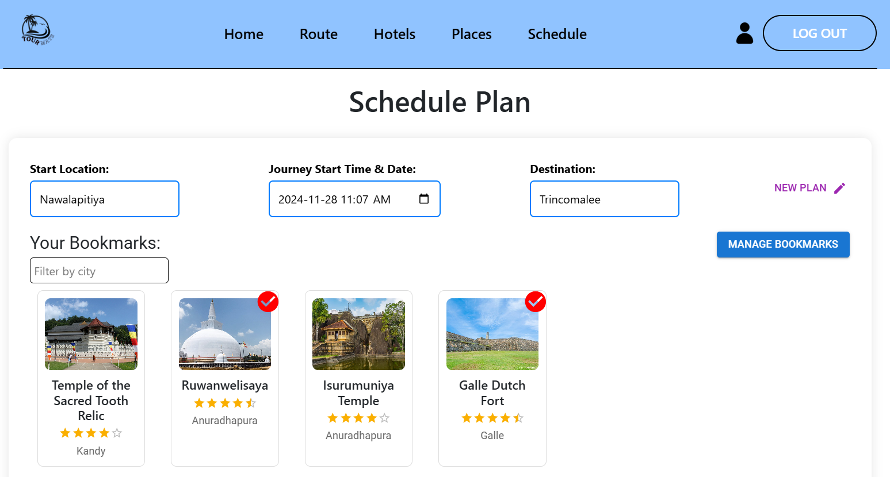
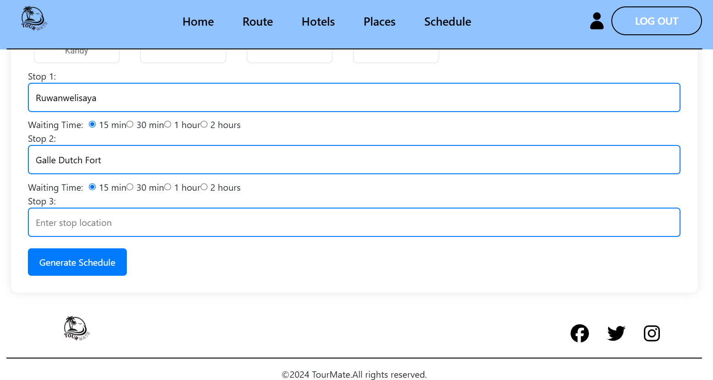
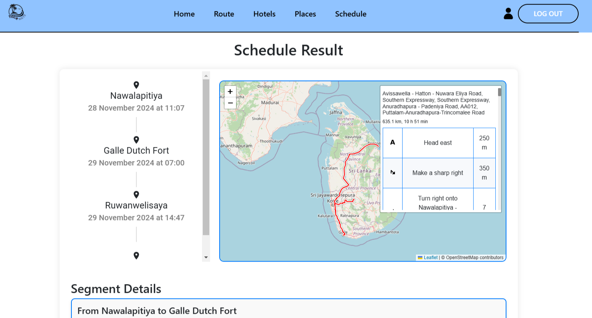
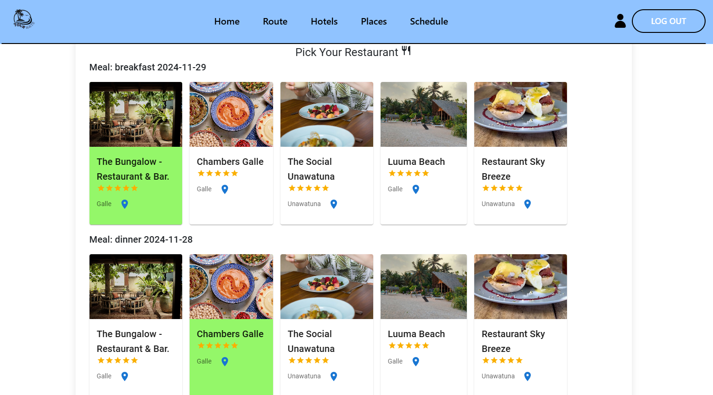
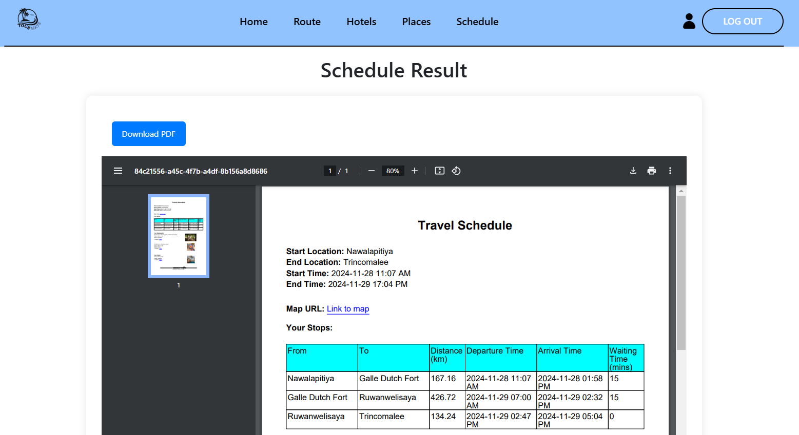

[comment]: # "This is the standard layout for the project, but you can clean this and use your own template"

# TourMate

---

## Team
-  E/20/248, Mapagedara T.L.B, [email](mailto:e20248@eng.pdn.ac.lk)
-  E/20/453, Yogesh R.J, [email](mailto:e20453@eng.pdn.ac.lk)
-  E/20/158, Jananga T.G.C, [email](mailto:e20158@eng.pdn.ac.lk)
-  E/20/300, Prasadinie H.A.M.T, [email](mailto:e20300@eng.pdn.ac.lk)

## Supervisor
-  Dr. Suneth Namal Karunarathna, [email](mailto:namal@eng.pdn.ac.lk)

## Table of Contents
1. [Introduction](#introduction)
2. [Core Features](#core-features)
3. [Technology Stack](#technology-stack)
4. [Screenshots](#screenshots)
5. [Links](#links)

---

## Introduction
Travelers often struggle with organizing efficient, budget-friendly itineraries due to scattered information and limited personalized guidance, leading to time-consuming planning and potentially higher costs. TourMate addresses this by providing:
+ Tailored travel routes based on user preferences.
+ Detailed trip schedules including accommodations, meals, and restaurant recommendations.
+ Easy exploration and bookmarking of attractions and lodging.
+ Automated route and timing calculations for efficient planning.
  
This is an all-in-one travel planning solution that offers **hotel finding, place discovery, weather reporting**, and a **detailed trip schedule** that includes **accommodations, meal recommendations**, and **optimized routes**. By integrating these features, the platform ensures a seamless, cost-effective, and well-organized travel experience tailored to individual preferences.

## Core Features
1. **Customizable Itineraries** :
Generate detailed schedules including accommodations, meals, and restaurant options.
2. **Route Optimization** :
Identify the best travel routes to save time.
3. **Place Recommendations** :
Discover attractions, hotels, and dining spots with detailed reviews.

## Technology Stack
+ **Frontend** : HTML, CSS, JavaScript, React.js .
+ **Backend** : Spring Boot.
+ **Database** : MySQL.
+ **APIs** : Open Street Map API, Booking.com API, TravelAdvisor API

## Screenshots
   
 

## Links

- [Project Repository](https://github.com/cepdnaclk/e20-CO227-TourMate ){:target="_blank"}
- [Project Page](https://cepdnaclk.github.io/e20-CO227-TourMate){:target="_blank"}
- [Department of Computer Engineering](http://www.ce.pdn.ac.lk/)
- [University of Peradeniya](https://eng.pdn.ac.lk/)

[//]: # (https://github.com/adam-p/markdown-here/wiki/Markdown-Cheatsheet)
